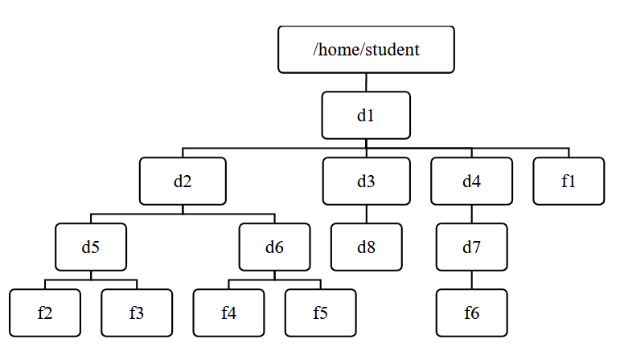
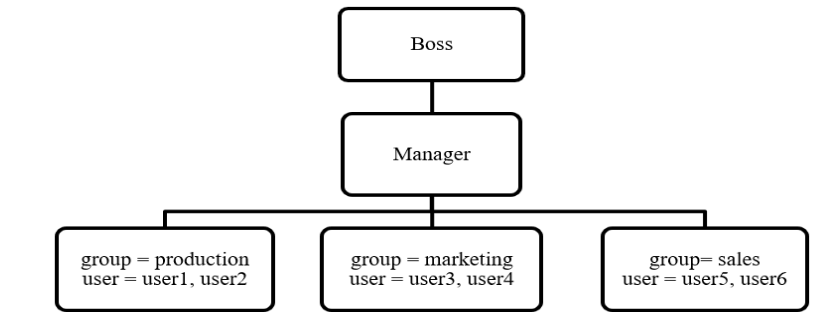

# LABORATORY ASSIGNMENT

## INSTRUCTIONS

- This is an individual assignment.
- All the Lab is based on CentOS Stream 9 and Programming Language (C or C++ or python).
- For lab 1 to 8 student must print their name, symbol no. in first line of output.
- Access Control, Intrusion and Network Security (based on Linux Machine)

---

## TASK 9

### Preparing Linux Lab Environment:

a) Installing a hypervisor (VMware Workstation or VMware Fusion or VirtualBox)  
b) Creating Virtual Machine of CentOS Stream 9  
c) Assign the hostname of Linux machine as `<yourname>.infosec.local`

---

## TASK 10

### Users, Groups, Permissions:

a) Create a user named `student`.

b) Login from student user then create files and folders according to following tree structure.  
(Where, d → directory and f → file)

c) Change the permission of the file `f1` so that the owner will get full permission, group member will get read and execute permission and others will get read-only permissions.

d) Change permission of the file `f2` such that the owner’s and group members will get read and write permission but others will get no permission.

e) Change permission of directory `d3` such that all categories of users will get full permissions.

---

## TASK 11

### User and Group Administration:

Task below are based on following structure

a) Create group for each department (**production, marketing, sales**)

b) Create user account (**user1, user2, user3, user4, user5, user6, manager, boss**) for each employee assigning them respective group.

c) Create common directory (**/root/production, /root/marketing and /root/sales**) for each department.

d) Change ownership of group directories such that **boss** will become the owner and the respective groups will be group owner.

e) Change the permission of the group directories such that only the owner and group member will get full permission and other will not get any permission.

---

## TASK 12

### Firewall Configuration:

a) Install firewalld package as well as start and enable firewalld services.

b) Add the following services and ports to allow packets through the firewall.  
`[Service = http, smtp   port = 25/tcp, 25/udp, 110/tcp]`

c) Remove the following services and ports to block packets through the firewall.  
`[Service = smtp   port = 25/tcp, 25/udp]`

---

## TASK 13

### Configuring SSH Server to allow/deny root login and allow/deny users login:

a) Install required package for OpenSSH server.

b) Allow ssh packets to enter through the firewall.

c) Start and enable ssh service.

d) Configure OpenSSH server to deny direct root login.

e) Configure OpenSSH Server to block login from users i.e., **ram, sita, hari**

---

## TASK 14

### Configuring SSH Server to allow/deny SSH login from selected hosts only:

a) Configure OpenSSH server to deny all hosts except the host (i.e., 192.168.10.10)

---

## TASK 15

### Configuring SSH Server for direct SSH login by generating and publishing private and public key:

a) Generate SSH key pair (**public and private**) in local host

b) Send a copy of the public key to the ssh server in which you want to direct login.

---

## TASK 16

### Secure Network Copy using “SCP”:

a) Copy remote file into the local system (**consider your own example**)

b) Copy local files to the remote host (**consider your own example**)

---

## TASK 17

### Security Enhanced Linux (SE Linux):

a) Check the current status of SE Linux

b) Configure the server to enable (**enforcing**) SE Linux

---

## TASK 18

### Configuring SSL-Enabled Apache (HTTPS) Server (self-signed):

a) Install required package for HTTPS server (**httpd, mod_ssl**)

b) Allow https (port 443) packets to enter through the firewall

c) Start and enable web service.

d) Generate self-signed key and cert files using openssl.

e) Configure web server to listen from port 443 and set DocumentRoot to  
`/var/www/html`, locate the required key and cert files.

f) Host a web page called `index.html` on web server named `<yourname>.infosec.local`
